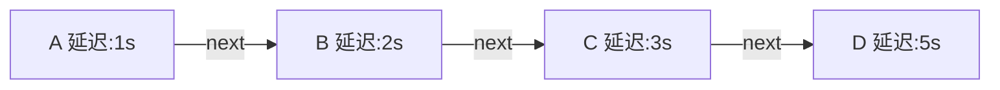
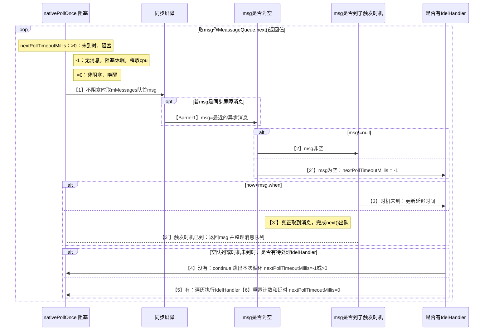
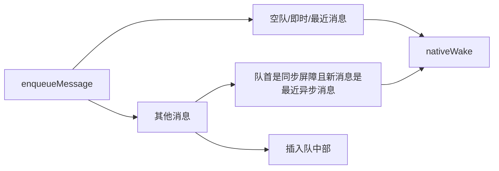

*本文适合对Handler有过了解，~~即使又忘了。~~但对网上的<<loop轮询转圈图>>有点印象的玩家。*

**前置概念**

------

**同步屏障消息**

1. 作用：系统使用的特殊的消息，可以看作优先处理异步消息的标识，当MessageQueue的队首是**同步屏障消息时**，忽略同步消息，一直执行最近的异步消息。通过`postSyncBarrier`/`removeSyncBarrier`增删同步屏障消息，非手动移除不会自动移除。
2. 特点：`target`属性为空的`Message`就是同步屏障消息
3. 事例：`ViewRootImpl.scheduleTraversals` 优先处理异步消息

**IdleHandler**

1. 作用：闲时`Handler`，在没有消息或消息未到触发时机这样的闲时，执行的操作。
2. 特点：是`MessageQueue`的静态接口，使用时复写`boolean queueIdle()`的方法执行闲时操作，返回值表示执行后是否保持存活状态。
**epoll**

[Linux IO模式及 select、poll、epoll详解](https://segmentfault.com/a/1190000003063859)

**正文**

------

*废话一下基本原理先*

使用者通过`Handler`外部暴露的方法，向处于目标线程`TLS`的`Looper`内的消息队列输入消息；

消息队列及时/延时地取出消息，并分发处理。以达到调度或延时地操作。

`Handler`通过`MessageQueue.enqueueMessage(msg,when)`入队消息

`Looper.loop`通过`MessageQueue.next()`出队消息

## MessageQueue

MessageQueue的关键变量`mMessages`：

消息队列实例，把消息根据触发时机早晚排列。具体代码表现为单链表的节点，代指队首（链表头）消息。



**入队出对**


1. 入队方法`enqueueMessage()`，往队列存延迟触发的消息，并根据触发时间排好队。
2. 出队方法`next()`一直死循环遍历队列，有到达触发时机的消息就取出消息。

**阻塞/休眠**：

怎么能让入队消息的延迟触发呢？

    先阻塞住next()方法，让其无法取消息。时间到了，在把阻塞恢复，取出消息即可。

队列内根本没消息，出队方法还一直死循环取消息，怎么办？

    没消息也阻塞住next()方法，让其无法取消息。有新消息插入时，再通知他去取。

| 队内的下条消息还有很久才到触发时机：先阻塞。 | 队内的根本没有消息：一直休眠到有消息。 |
| --- | --- |
|  |  |

**具体做法**

`next()`的取消息死循环中用`nativePollOnce(ptr, nextPollTimeoutMillis)`阻塞/休眠。

- 消息的触发时机未到时，阻塞到触发时机到为止；
- 队列内一直没消息时，休眠直到有新消息入队，再用`enqueueMessage()`内的`nativeWake(mPtr)`唤醒。

> 本文中分别用**阻塞**和**休眠**只是做语义区分：是自己超时返回，还是被动触发唤醒。
>
> `nativePollOnce`传入的参数`timeout`通过JNI到Native层`Looper::pollOnce`->`Looper::pollInner` ->`epoll_wait`方法。
>
> `epoll_wait`用 `epoll_create`创建的文件描述符A，去监听管道读取端文件描述符B的事件(使用`epoll_ctl`添加)。
>
> - timeout>0时，监听时长超过这个`timeout`仍没有事件就返回，中断阻塞。
> - timeout=-1，`epoll_wait`一直等待，直到新消息入队`enqueueMessage()`内`nativeWake(mPtr)`在Native层向管道写入端写入“W”，触发监听中断阻塞。同时清空管道数据。
>
> 上边两种情形，都会给返回一种result，而`pollOnce`收到任何一种result都会退出。
>
> epoll I/O复用机制是用一个文件描述符监听多个文件描述符的事件。
>
> Looper.prepare -> new Looper -> new MessageQueue->nativeInit->native层NativeMessageQueue构造方法中实例化Looper的构造方法中初始化管道和`epoll_create`    `nativeWake`最终也是`Looper.wake`

## 出队
`nativePollOnce(ptr, nextPollTimeoutMillis)`方法参数**nextPollTimeoutMillis** (即下个消息的延迟时间的)取值情况。
| 下个消息的延迟时间 | 消息队列内                   | 阻塞情况       |             |
| :----------------- | ---------------------------- | -------------- | ----------- |
| >0                 | 延迟最近的消息，触发时机未到 | 阻塞到触发时机 | 释放cpu资源 |
| =0                 | 延迟最近的消息，触发时机到了 | 不阻塞         |             |
| =-1                | 根本没消息                   | 休眠到有消息   | 释放cpu资源 |


### 流程解读

`next()`出队方法，需要一个`Message`返回值。当`nativePollOnce`不再阻塞时，因为队列是按触发时机早晚排序的：

1. 通常应该取队首消息；

2. 但是队首是同步屏障消息时【Barrier1】，应该取触发时机最近的异步消息。

因此我们先取该msg，不管是队首还是最近异步，再判断是否应该将其返回和其他后续操作。

- 当msg非空时【2】

  1. 如果msg触发时机到达【3`】，则返回msg。（当然返回前要整理一下队列）
  2. 如果msg触发时机未到【3】，则重新计算触发时间，然后将 **nextPollTimeoutMillis** 设为新时间，然后像下文"当msg为空时"一样，进行是否有IdleHandler及对其处理的操作。【4】/【5，6】

- 当msg为空时【2`】，先将 **nextPollTimeoutMillis** 设为-1

  1. 如果也没有待处理的IdleHandler【4】：则跳出本次循环又回到`nativePollOnce`，此时`nextPollTimeoutMillis=-1`,阻塞至有新消息将其唤醒。
  2. 如果有待处理的IdleHandler：则遍历执行这些IdleHandler【5】（每次最多四个，执行其`queueIdle`回调），然后重置IdleHandler计数和`nextPollTimeoutMillis=0`完成本次循环【6】（`nextPollTimeoutMillis=0`让下次循环不再阻塞，以检查处理IdleHandler时是否又有新消息入队）。
```java
Message next() {
    final long ptr = mPtr;/*MessageQueue 的native层地址*/
    if (ptr == 0) {//当消息循环已经退出,则直接返回
        return null;
    }
    int pendingIdleHandlerCount = -1; //待处理闲时handler数量
    int nextPollTimeoutMillis = 0;
    for (;;) {
        nativePollOnce(ptr, nextPollTimeoutMillis);//【1】阻塞：作用类似Java的 object.wait()
        synchronized (this) {
            final long now = SystemClock.uptimeMillis();
            Message prevMsg = null;
            Message msg = mMessages;/*next()的返回值：此时为队头消息，即最近消息*/
            if (msg != null && msg.target == null) {//【Barrier1】如果队首是同步屏障消息，msg取最近的异步消息
		do {
                   prevMsg = msg;
                   msg = msg.next;
                } while (msg != null && !msg.isAsynchronous());//msg不是异步消息时，从队头至队尾遍历每个消息，直到msg为异步消息才推出遍历
            }            
            if (msg != null) {//【2】取到待处理的msg
                if (now < msg.when) {/*【3】时机未到：更新延迟时间*/
                    nextPollTimeoutMillis = (int) Math.min(msg.when - now, Integer.MAX_VALUE);
                } else {/*【3`】处理msg的时机已到：取出msg，并整理队列*/
                    mBlocked = false;/*是否被阻塞：设为false供存消息时用*/
                    if (prevMsg != null) {/*【Barrier1`】若msg是因同步屏障循，而取出的最近的异步消息，改变指针指向跳过msg*/
                        prevMsg.next = msg.next;
                    } else {/* 取出msg，更新下一条消息为队首*/
                        mMessages = msg.next;
                    }
                    msg.next = null;//即将作为返回值，next变得没意义，置空。
                    return msg;/* 返回next消息*/
                }
            } else {/*【2`】消息为空，即没有消息了*/
                nextPollTimeoutMillis = -1;/*没有消息了，nextPollTimeoutMillis设为-1。线程阻塞*/
            }
            
            /*------------------------------空闲handler处理----------------------------------*/
            /* Idlehandles仅在队列为空或队首消息时机未到时才运行*/
            if (pendingIdleHandlerCount < 0
                    && (mMessages == null || now < mMessages.when)) {
                pendingIdleHandlerCount = mIdleHandlers.size();/*计算闲时任务量*/
            }
            if (pendingIdleHandlerCount <= 0) {
                mBlocked = true;/*【4】若经过计算上个if计算，连闲时Handler都没有，跳出本次循环*/
                continue;
            }
            if (mPendingIdleHandlers == null) {/*必有闲时任务待处理，否则上个if就continue出去了*/
                mPendingIdleHandlers = new IdleHandler[Math.max(pendingIdleHandlerCount, 4)];
            }
            mPendingIdleHandlers = mIdleHandlers.toArray(mPendingIdleHandlers);
        }
        /*【5】必有闲时Handler需要遍历执行。连闲时Handler都没有的情况，在上文的if中continue出去。*/
        for (int i = 0; i < pendingIdleHandlerCount; i++) {
            final IdleHandler idler = mPendingIdleHandlers[i];
                //【5.1】执行IdleHandler的queueIdle方法，运行IdelHandler，例如处理日志上报 Gc等通过返回值由自己决定是否保持存活状态
               idler.queueIdle();
        }
	/*【6】执行完闲时Handler重置闲时计数和下次延迟时间*/
        pendingIdleHandlerCount = 0;
        // 因为执行闲时Handler(步骤【5】不在synchronized中)过程中，可能有新消息enqueue，需要重新检查。
        // 下次延迟时间置0，下次循环到步骤【1】时不阻塞。
        nextPollTimeoutMillis = 0;
    }
}
```
### 时序图


## 入队

**关键变量**`mBlocked`：源码上的注释翻译过来：出队方法`next()`是否被阻塞在`pollOnce()`处（`nextPollTimeoutMillis≠0`）。记录`pollonce`是否被阻塞的目的就是：**是否需要唤醒**

外部暴露操作方法的`Handler`类下，`send(empty)Message/post ` +`atTime/delay/AtFrontOfQueue`等操作的最终归宿。
`enqueueMessage(Message msg, long when)`：插入`msg`入队，`when`是自系统启动以来的非休眠运行时间（毫秒）。

> 拓展： 插入msg一个到队首。
>
> ```java
> public final boolean sendMessageAtFrontOfQueue(Message msg) {//同理post也有类似方法
>  MessageQueue queue = mQueue;
>  return enqueueMessage(queue, msg, 0);
> }
> private boolean enqueueMessage(MessagdsieQueue queue, Message msg,
>      long uptimeMillis) {
>  return queue.enqueueMessage(msg, uptimeMillis);
> }
> ```

`enqueueMessage(Message msg, long when)`：插入`msg`入队，`when`是自系统启动以来的非休眠运行时间（毫秒）。


### 流程解读

入队一个消息，流程参考存消息的情况图，并对照下边的代码。

#### 情况【一】
队列为空、新消息是即时消息、新消息是延时最短消息时

入队的新消息插入到队头的情况：都需要`nativeWake`唤醒 出队的`pollonce`
**a.队列内没消息** |**b.新入队的消息延时为0** |c.新入队的消息比队首的触发时机还早，与b类似|
| --- | --- | --- |
|   | ||


1. 通过改变队首消息和新消息的next指针指向，把消息插入。
2. 是否需要唤醒`needWake = mBlocked`, 这时候出队`pollonce`处**队列还没消息**或**最近消息时机未到**，还被**阻塞**，**mBlocked=true**是必然的。然后`nativeWake`去唤醒`pollonce`去取刚存入的消息。

#### 情况【二】

新消息不是上述的情况，不插入到队首，而是插入到队列中部。先查找位置再插入。

| 队头是同步屏障消息 |且插入的消息是最近的异步消息|插入的消息不是最近的异步消息|
| --- | --- | --- |
|  |  | |
| 是否需要唤醒 | 需要唤醒 |不需要唤醒 |

**除非队头是同步屏障消息，插入的消息是最近的异步消息**，其他多数插入到队列中部的情况都不需唤醒

是否需要唤醒的条件`needWake = mBlocked && p.target == null && msg.isAsynchronous();`

1. 出队`pollonce`处最近消息时机未到（经过上个if，队列现在非空），还被阻塞，**mBlocked=true**还是必然的。
2. `p.target == null  `队首p的target为空符合同步屏障消息特点。
3. `msg.isAsynchronous()` 新插入队列中部的消息是异步消息。

合起来**唤醒条件**就是：“**队列内最近的消息触发时机未到，且队首消息是同步屏障消息时，新插入了一条异步消息**”（还可能改变）。

然后再通过改变`next`指针指向，从队首至队尾遍历，查找合适的插入位置：


1. `（when < p.when）`即新消息触发时机早于该位置的触发时机，插入位置找到，跳出遍历。
2. `p == null`遍历到末尾，新消息的触发时机比队内的消息都晚，插入位置为队尾，跳出遍历。
3. 查找插入位置的过程中。如果发现异步消息，则新消息虽异步，但不是离触发最近的，无需唤醒。因此**唤醒条件**更新为：队首是同步屏障消息时，新插入的消息为**离触发最近的异步消息**。

最后改变指针指向，把消息插入到对应位置。

```java
boolean enqueueMessage(Message msg, long when) {    
    synchronized (this) {/*可能有多个不同线程发消息*/
        msg.when = when;
        Message p = mMessages;// p 赋值为队首。根据触发时机when 来排序
        boolean needWake;
        if (p == null || when == 0 || when < p.when) {
          //【一】插入头部并唤醒：1、队列为空时 2、新消息延时为0是即时消息 3、新消息延时比队首的更短
            msg.next = p;
            mMessages = msg;
            needWake = mBlocked;/*出队方法next是否被阻塞在pollOnce()处（nextPollTimeoutMillis≠0）*/
        } else {//【二】消息插入MessageQueue中间，一般不需唤醒线程。除非队首同步屏障，且msg为!最近的!异步消息
            //【二a】队首是同步屏障消息，且插入的msg是异步消息。
            needWake = mBlocked && p.target == null && msg.isAsynchronous();
            Message prev;
            for (;;) {
                prev = p;
                p = p.next;
                /*prev、p 从队列的0、1 一直增至 last、null，来寻找msg合适的插入位置*/
                if (p == null /*last.next=null 插入到末尾*/|| when < p.when/*（队列的p.when越来越大1235，when=4）*/
                    break;
                }
                if (needWake && p.isAsynchronous()) {//【二b】插入的msg是异步消息是最近的
                    //在寻找msg插入位置过程中发现异步消息。说明msg前还有更早的异步消息。msg虽异步、但非最近。不需唤醒
                     needWake = false;
                }
            }
            /*经过循环确定插入位置，将入队的msg插入到prev与p中间 （3-5之间）*/
            msg.next = p; 
            prev.next = msg;
        }
        if (needWake) {
            nativeWake(mPtr);//【三】唤醒线程，nativePollOnce不在阻塞
        }
    }
    return true;
}
```
### 流程图

